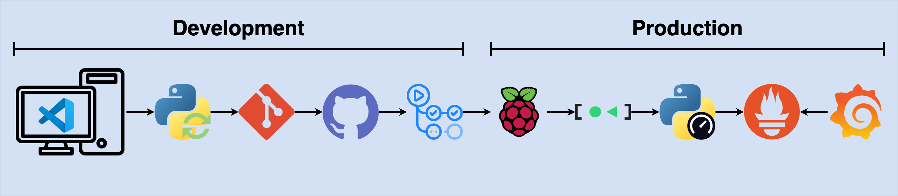

# Speedtest Service

## Getting Started
TODO

### Speedtest Service Flowchart


### Raspberry Pi
* A Raspberry Pi is a small, affordable, single-board computer. Developed by the [Raspberry Pi Foundation](https://www.raspberrypi.org/), it has gained widespread popularity for its versatility and low cost. A Raspberry Pi is a popular choice for running Prometheus and Grafana projects, especially for small-scale or home-based monitoring setups. In order to configure our Raspberry Pi, we may refer to [Getting started](https://www.raspberrypi.com/documentation/computers/getting-started.html#getting-started-with-your-raspberry-pi) Raspberry Pi official documentation. In Speedtest Service case we've used a Raspberry Pi 3 Model B with Raspberry Pi OS Lite (64-bit) operating system and a SD card with 32GB of storage.

### Clone GitHub Repository
* Firstly let's ensure that your packages are up to date and then install Git.
```bash
sudo apt-get update
sudo apt-get install git
```

* To verify that Git is installed, we may run the command below.
```bash
git --version
```

* Create */scripts* directory.
```bash
sudo mkdir /scripts && cd /scripts
```

* Clone [Speedtest Service](https://github.com/nunodiogosilva/speedtest.git) GitHub repository into */scripts* directory.
```bash
sudo git clone https://github.com/nunodiogosilva/speedtest.git && cd speedtest
```

* Change the ownership of */scripts* directory to your user, you may use the command below. Make sure to replace <username> with your username.
```bash
sudo chown -R <username>:root /scripts
```

### Create Virtual Environment
* Python virutal environments isolate dependencies for projects, allowing different projects to use different packages and versions without conflicts. They ensure clean, independent setups. To create a virtual environment, run the command below in */scripts/speedtest* directory. This will create a new virtual environment in a local folder named *.venv*
```bash
python3.11 -m venv .venv
```

* Before you can start installing or using packages in your virtual environment you'll need to activate it in */scripts/speedtest* directory. Activating a virtual environment will put the virtual environment specific Python and pip executables into your terminal.
```bash
source .venv/bin/activate
```

* If you want to switch projects or leave your virtual environment, you may deactivate it using the command below in */scripts/speedtest* directory.
```bash
deactivate
```

* You may refer to [Python Packaging Official Documentation](https://packaging.python.org/en/latest/guides/installing-using-pip-and-virtual-environments/) for additional information about Python virtual environments.

### Python PIP Requirements
* Run the command below in */scripts/speedtest* directory where *requirements.txt* file is located. This command will read *requirements.txt* file and install all the specified packages and their dependencies.
```bash
pip3.11 install -r requirements.txt
```

* Alternatively, if you've installed a new Python package that it's not in *requirements.txt* file, you may use the command below in */scripts/speedtest* directory to list all the packages installed and their versions. You then redirect the output to *requirements.txt* file.
```bash
pip3.11 freeze > requirements.txt
```

* If you want to start fresh but you don't want to delete the virtual environment that you've created, you may uninstall all Python packages running the command below in */scripts/speedtest* directory.
```bash
pip3.11 freeze | xargs pip3.11 uninstall -y
```

* To get the most up to date packages versions and upgrade them automatically we may use *pip-review* package which lists available updates and it can also automatically or interactively install available updates. Run the command below in */scripts/speedtest* directory. You may refer to [PyPI Official Documentation](https://pypi.org/project/pip-review/) for additional information about *pip-review* Python package.
```bash
pip-review --interactive
```

### Prometheus
* Prometheus is an open-source monitoring and alerting toolkit designed for reliability and scalability. Prometheus stores all metrics data as time series and will be used has a datasource. In order to install Prometheus in our Raspberry Pi, we may use the commands below. **If you're using a different operating system please refer to [Download](https://prometheus.io/download/) Prometheus official documentation to find the right operating system.**
```bash
sudo apt-get install prometheus
```

* Prometheus should start automatically after installation. To ensure it starts on boot, we need to enable it.
```bash
sudo systemctl enable prometheus
sudo systemctl start prometheus
```

* To verify that Prometheus is running, we may run the command below.
```bash
sudo systemctl status prometheus
```

* You can access the Prometheus web UI at [localhost:9090](http://localhost:9090).

### Grafana
* Grafana is an open-source platform for monitoring and observability, which allows users to visualize, analyze, and understand metrics, logs, and traces collected from various sources in real-time. Grafana will be used to visualize Prometheus datasource metrics. In order to install Grafana in our Raspberry Pi, we may use the commands below. **If you're using a different operating system please refer to [Install Grafana](https://grafana.com/docs/grafana/latest/setup-grafana/installation/) official documentation to find the right operating system.**
```bash
sudo apt-get install -y apt-transport-https software-properties-common wget
```

* Import GPG key.
```bash
sudo mkdir -p /etc/apt/keyrings/
wget -q -O - https://apt.grafana.com/gpg.key | gpg --dearmor | sudo tee /etc/apt/keyrings/grafana.gpg > /dev/null
```

* Add a repository for stable releases.
```bash
echo "deb [signed-by=/etc/apt/keyrings/grafana.gpg] https://apt.grafana.com stable main" | sudo tee -a /etc/apt/sources.list.d/grafana.list
```

* Update the list of available packages.
```bash
sudo apt-get update
```

* Install Grafana.
```bash
sudo apt-get install grafana
```

* After installation, you need to start Grafana. To ensure it starts on boot, we need to enable it.
```bash
sudo systemctl enable grafana-server
sudo systemctl start grafana-server
```

* To verify that Grafana is running, we may run the command below.
```bash
sudo systemctl status grafana-server
```

* You can access the Grafana web UI at [localhost:3000](http://localhost:3000).

### Speedtest Service Setup
* In order to setup Speedtest Service on your Raspberry Pi, you may set it up automatically or manually. To do it automatically you may use the command below in */scripts/speedtest* directory.
```bash
python3.11 -m app.setup
```

* If you want to setup Speedtest Service manually, you may follow the steps below.
  #### 1. Prometheus
  * Edit Prometheus configuration file to include the metrics generated by Speedtest Service.
  ```bash
  sudo rm /etc/prometheus/prometheus.yml
  sudo touch /etc/prometheus/prometheus.yml
  sudo nano /etc/prometheus/prometheus.yml
  ```

  * Copy and paste the following Prometheus configuration file content.
  ```yml
  # Global configuration
  global:
    scrape_interval: 15s # How often to scrape metrics (default is 1m)
    evaluation_interval: 15s # How often to evaluate rules (default is 1m)

  # A scrape configuration containing endpoints to scrape.
  scrape_configs:
    - job_name: 'prometheus'
      static_configs:
        - targets: ['localhost:9090']

    - job_name: 'node'
      static_configs:
        - targets: ['localhost:9100']

    - job_name: 'metrics'
      static_configs:
        - targets: ['localhost:8000']
  ```

  * Restart Prometheus in order to add the configurations.
  ```bash
  sudo systemctl restart prometheus
  ```

  #### 2. Grafana
  * TODO (Add Service Account Token) 
  * TODO (Add datasource)
  * TODO (Add dashboard)

  #### 3. Systemd Service
  * A Systemd service is a system unit managed by Systemd init system in Linux. It allows to define and control the behavior of a application, such as starting it at boot, stopping it, restarting it and checking it status. Let's now create a new Systemd service for Speedtest Service using the commands below.
  ```bash
  sudo touch /etc/systemd/system/speedtest.service
  sudo nano /etc/systemd/system/speedtest.service
  ```

  * Copy and paste the following Systemd configuration file content.
  ```ini
  [Unit]
  Description=Speedtest Service
  After=network.target

  [Service]
  EnvironmentFile=/etc/environment
  WorkingDirectory=/scripts/speedtest
  ExecStart=/usr/bin/sh -c "cd /scripts/speedtest && /usr/bin/python3.11 -m app.run"
  Restart=always

  [Install]
  WantedBy=multi-user.target
  ```

  * After creating a Systemd service for Speedtest Service, you'll need to reload Systemd files and start Speedtest Service. To ensure it starts on boot, we also need to enable it.
  ```bash
  sudo systemctl daemon-reload
  sudo systemctl enable speedtest.service
  sudo systemctl start speedtest.service
  ```

  * To verify that Speedtest Service is running, we may run the command below.
  ```bash
  sudo systemctl status speedtest.service
  ```

### GitHub Actions
* TODO (Add GitHub Actions)

## Tools
|                                                                                              | Name                                                                   | Purpose          |
|----------------------------------------------------------------------------------------------|------------------------------------------------------------------------|------------------|
|                    | [Visual Studio Code](https://code.visualstudio.com/)                   | Code Editor      |
|                          | [Git](https://git-scm.com/)                                            | Version Control  |
|                    | [GitHub](https://github.com/)                                          | Code Repository  |
|    | [GitHub Actions](https://github.com/features/actions)                  | CI/CD            |
|        | [Raspberry Pi OS Lite (64-bit)](https://www.raspberrypi.com/software/) | Operating System |
|                  | [Systemd](https://systemd.io/)                                         | Service          |
|                    | [Python (3.11)](https://www.python.org/)                               | Scripting        |
|  | [Ookla Speedtest](https://www.speedtest.net/)                          | Benchmarking     |
|            | [Prometheus](https://prometheus.io/)                                   | Collect Metrics  |
|                  | [Grafana](https://grafana.com/)                                        | Analyze Metrics  |

## Authors & Maintainers
| Name       | LinkedIn                                                                      | Role   |
|------------|-------------------------------------------------------------------------------|--------|
| Nuno Silva | [in/nunodiogosilva](https://www.linkedin.com/in/nunodiogosilva/) | Author |

